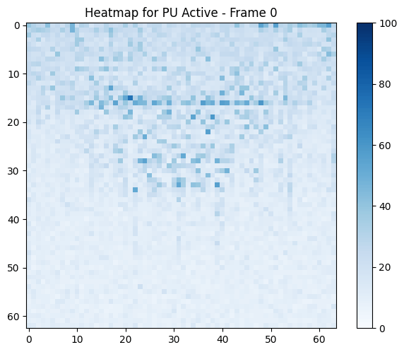
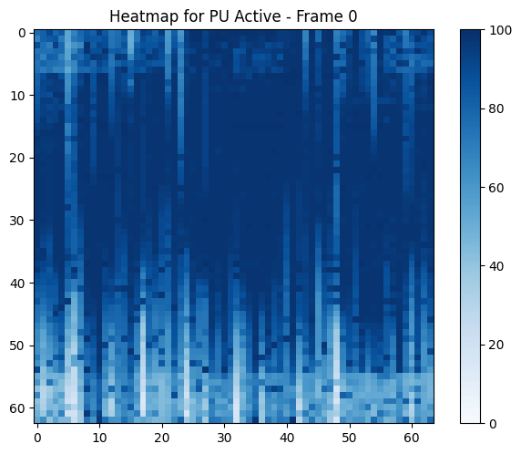
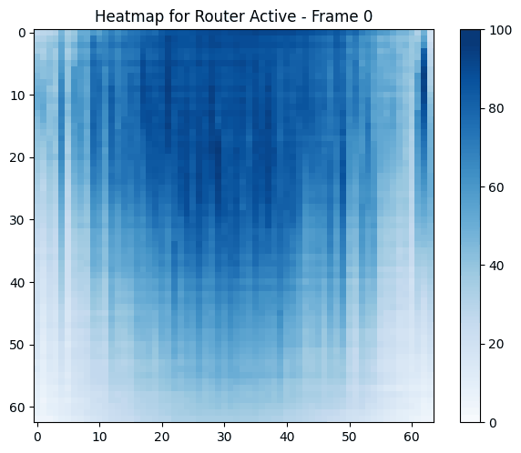
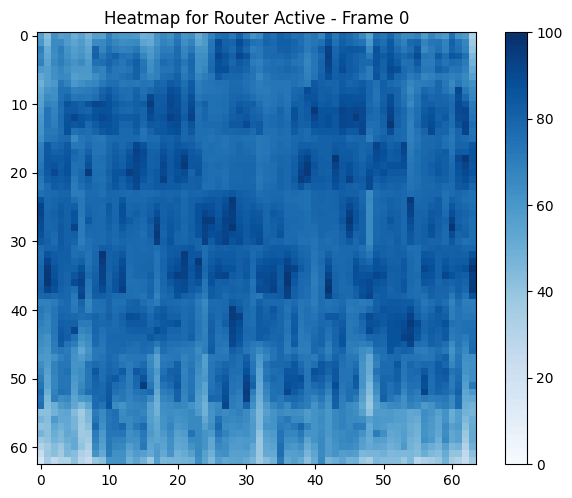

Animation of the mesh NoC PU and router activity when running BFS on R22 in Dalorex (left) and Tascade (right).
Router activity denotes messages being routed; no activity can mean that the router has no messages to route or that the NoC is clogged and messages are stuck.
The animation is composed of snapshots at a rate of a frame per 40 microseconds, thus, the number of frames indicates runtime (38 for Dalorex and 12 for Tascade).

<table>
<tr>
<td>

### PU Activity (Dalorex)

</td>
<td>

### PU Activity (Tascade)

</td>
</tr>
<tr>
<td>

### Router Activity (Dalorex)

</td>
<td>

### Router Activity (Tascade)

</td>
</tr>
</table>

